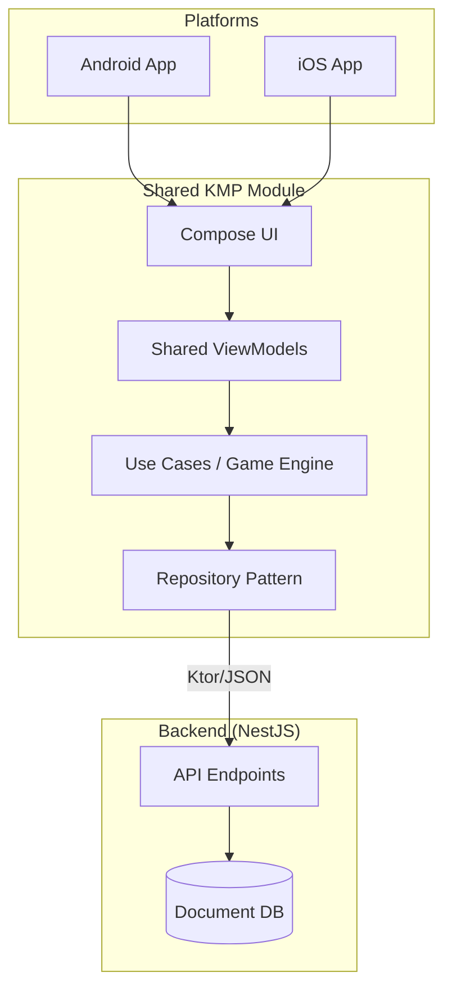
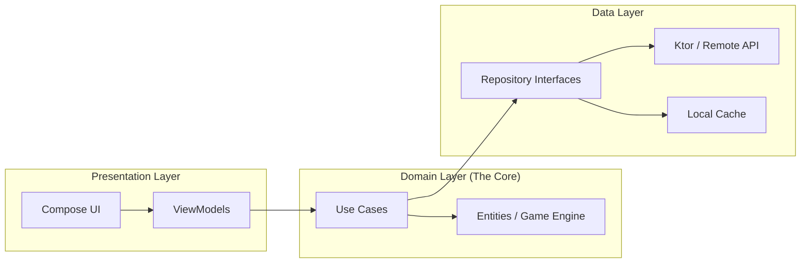

# 🛠️ Implementation Roadmap Overview

## Phase 1: The Foundation (Shared Domain)

* **Goal:** Define the "Source of Truth" without any platform dependencies.
* **Tasks:**
* Define Entities (`Board`, `Tile`, `User`).
* Implement **2048 Logic Engine** (Move, Merge, Spawn logic) in the `:shared` module.
* **TDD focus:** Write all Move/Merge unit tests here.

## Phase 2: The Infrastructure (Backend & Data)

* **Goal:** Establish data persistence and the "Cross-Platform" sync bridge.
* **Tasks:**
* **Backend:** Set up NestJS with a generic Document DB (e.g., MongoDB/Firestore) for the Leaderboard and State Sync endpoints.
* **Shared Data Layer:** Implement `Ktor` clients and Repository interfaces in KMP.
* **Contract Testing:** Ensure KMP Models match NestJS DTOs using `kotlinx.serialization`.

## Phase 3: The State & UI (Shared Presentation)

* **Goal:** Connect the logic to the screen using Compose Multiplatform.
* **Tasks:**
* Create **Shared ViewModels** to manage game state (MVVM).
* Build **Small Compose Components** (Tile, Score, Grid) with `@Preview`.
* Implement **Instrumented Tests** for swiping and merging interactions.

## Phase 4: Platform Integration & CI/CD

* **Goal:** Polish and Automate.
* **Tasks:**
* Configure Android/iOS specific entry points.
* Finalize **GitHub Actions** for automated testing and 90% coverage enforcement.

---

## 📊 System Flow (Mermaid)



---

## 📂 Final Project Structure

```text
.
├── backend-nestjs/           # NestJS + MongoDB/Firestore
├── shared/
│   ├── src/commonMain/       # 80% of your code lives here
│   │   ├── kotlin/
│   │   │   ├── domain/       # Entities, Logic, UseCases (TDD)
│   │   │   ├── data/         # Ktor API Client, Repositories
│   │   │   ├── presentation/ # ViewModels (MVVM)
│   │   │   └── ui/           # Compose Multiplatform Components
│   ├── src/androidMain/      # Android Specifics (Previews)
│   └── src/iosMain/          # iOS Specifics (UIKit/SwiftUI Wrappers)
├── androidApp/               # Android Manifest & Launcher
├── iosApp/                   # Xcode Project
└── .github/workflows/        # CI/CD (Tests & Coverage)

```

---

## 📈 Dependency Graph (Architecture)


